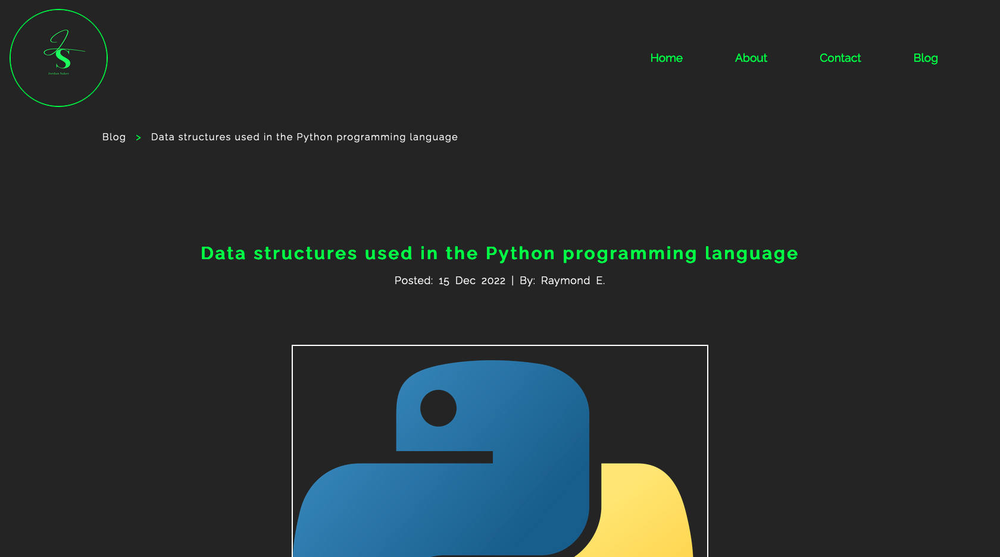

# Coder Academy T1A2 - Portfolio Assignment

**Published URL:** https://portfolio-jordansaker.vercel.app/

**GitHub repository:** https://github.com/jordansaker/WebPortfolio

**Youtube Presentation:** 

### **Description:**

The purpose of this website is to provide a platform to display my work, provide a quick way for potential employers to view my work history and developer skills, and to contact me using their prefered method of contact.

#### Functionality and Features
- Animated terminal display that contains links on each page
- Terminal animation occurs when terminal is hovered over
- All hover effects only happen when screen width is greater than 1080px to account for tablet landscape view. So for the terminal feature, the terminal window is collapsed by default when the screen width is less than 1080px
- Hero image has filter animation apllied to it on load of page
- Responsive nav bar that collapses the nav links into a hamburger menu when the screen width is less than 650px
- Project card display that shows completed and/or upcoming projects. The feature is included in the Index and About page. The card display is animated and has a hover effect for applicable screen widths.
- Social media icons animated
- Entire wesbite is responsive

#### Screenshots
##### Desktop screenshots

##### Mobile screenshots

#### Sitemap
Below is a screenshot of the sitemap overview. I have an index page with 3 other pages and one of those 3 pages (Blog page) linking to 5 pages (Blog posts). Index, Blog, Contact, and About pages are all accessible through the navbar while the 5 blog pages are only accessible through a listing on the Blog page.

#### Target Audience
The target audience for this website is potential employers looking to preview work history and engage a web developer.
#### Tech Stack

- HTML 5
- CSS
- **Deployment:** Vercel